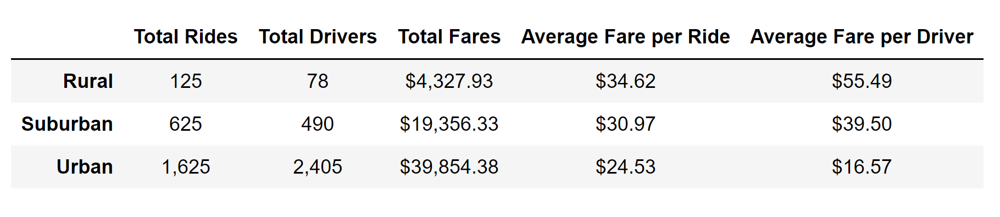
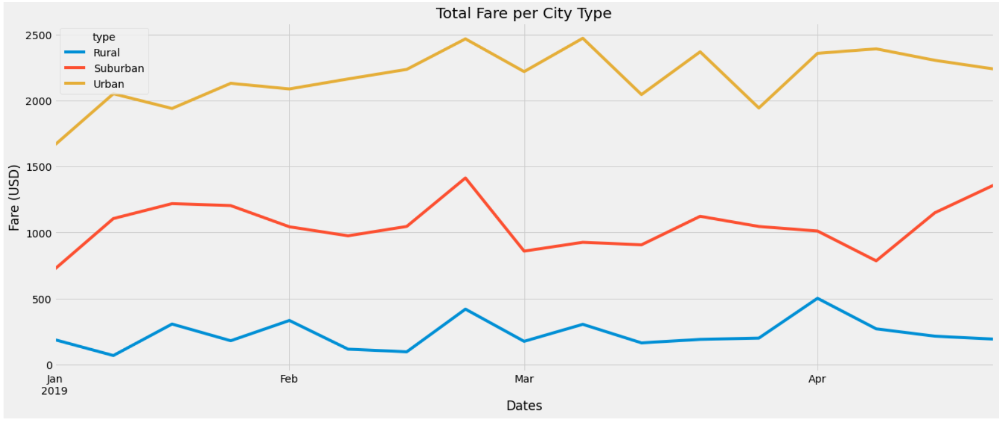

# PyBer Analysis, A ride-sharing app company

## 1. Overview of the analysis

This is the challenge activity for the module 6 of the Data Analytics and Visualization Boot Camp of the university of Texas at Austin.
The main idea is to apply the learned skills in Pyhon, Pandas and Matlotlib.

The project  was based on data of  PyBer, a ride-sharing app company. 
The objective was  to analyze all the rideshare data from January to early May of 2019, create a powerful visualization and be able to generate valuable insights

## 2. Results:

### The first deliverable of this analysis was this Data frame that works perfectly as a Summary
 

  We clearly see these points:
  
  - Total Urban Rides were 1,625. This represents the 68%, Suburban rides the 26% and the Rural rides  the 5%
  
  - Total Urban Drivers  were 2,405, this is the 81% of all the drivers in PyBer. Where the  total of Rural drivers were only 78, this means only the 2.6%
  
  - Total Urban Fares was $39,854,  this is the 63% of the money.
  
  - The Rural Rides have the highest average fare: $34.62.and the lowest average  fare is for the Urban Rides.
  
  - The Rural Drivers have the highest average fare per driver: $55.49 where the Urban Drivers have the lowest: $16.57
  
 ### The second deliverable was a graphic were we can see the Total Fares per City Type in a line chart from January to May 2019
  
  
   We can get a clear insight with this graph:
   
  - The proportion of each city type is consistent throughout this period.

## 3. Summary: 
Based on the valuable insights we could get with this analysis we have 3 recommendations:

1. Lower the number of drivers in the Urban cities. The number of drivers is 81% where the number if rides is 68%

2. Increase the number of Driver is the rural area. The total drivers here, is only  2.6% .It is a clear opportunity to increase the labor force.

3. Implement some marketing strategy to capture more users. It is clear the Total Fare in the Rural cities is  only 6.8% of the Total  Fare. There is a good growing revenue opportunity
